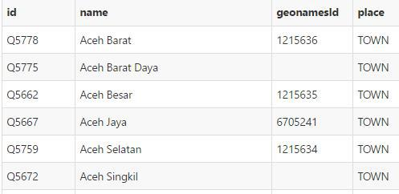
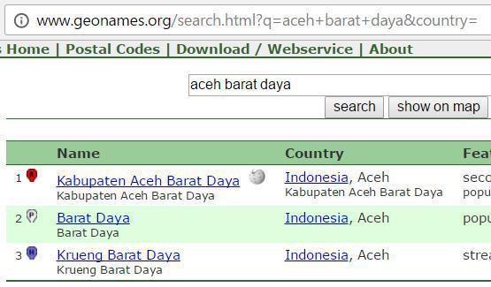
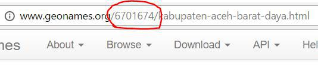
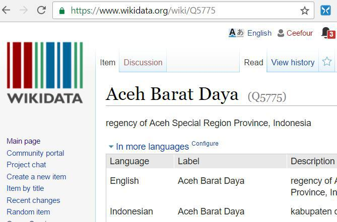
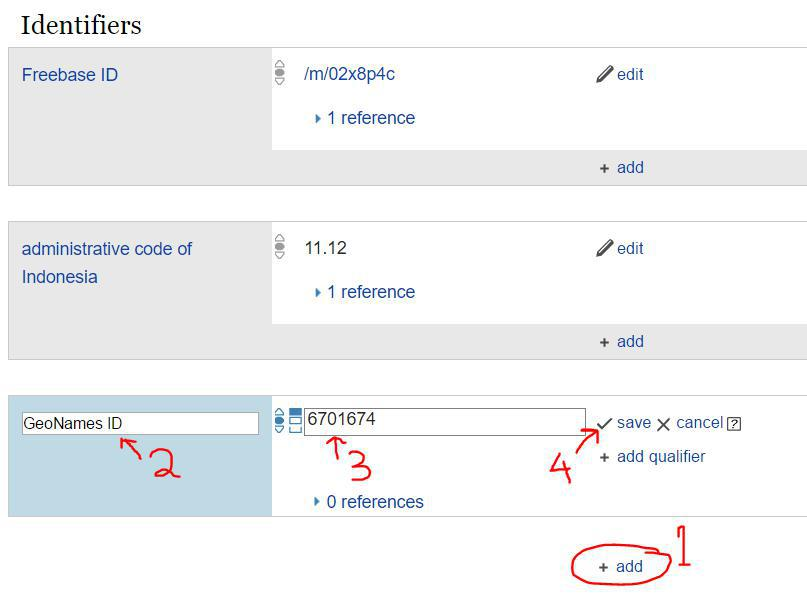
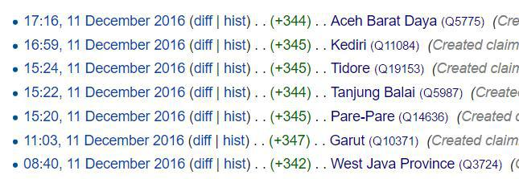

# Wikidata<-GeoNames Game

Teman-teman, mau game yang serius ga? ;) dan in syaa Allah bermanfaat bagi bangsa Indonesia. ^_^

Dari 512 kota & kabupaten Indonesia di Wikidata, masih ada 304 yang belum tertaut ke GeoNames : https://github.com/soluvas/opendata/blob/master/wikidata/locality.id.csv

Ada yang berminat jadi volunteer game ini ? :D

Cara mainnya lumayan mudah koq :)

1. Cari yang kosong di https://github.com/soluvas/opendata/blob/master/wikidata/locality.id.csv . Misalnya Aceh Barat Daya, kan masih kosong tuh geonamesId-nya

    

2. Kita cari deh kabupaten tersebut di geonames.org, ketemu kan, trus klik icon "A" warna merah

    

3. Ketemu deh GeoNames ID-nya

    

4. Kamu cari kabupaten tersebut di http://wikidata.org .. nah ketemu kan, scroll ke bawah

    

5. Di bagian Identifiers, klik add, pilih "GeoNames ID", masukin ID-nya, trus klik Save. Udah deh selesai! Lanjut ke kabupaten berikutnya...

    

Ada yang berminat ? 😁 Dengan berpartisipasi di game ini teman-teman otomatis sudah menyumbang open data untuk dapat dimanfaatkan di Indonesia ^_^

Tidak perlu bikin akun apa pun untuk mengikutinya. Tapi kalau teman-teman ingin kontribusi tersebut tercatat, teman-teman boleh juga membuat akun di http://wikidata.org :) seperti punya Hendy berikut ini:

